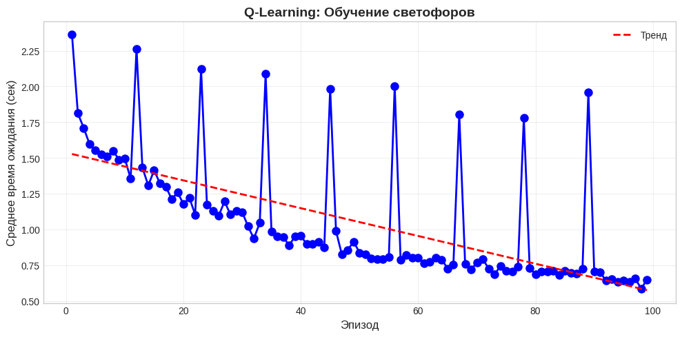
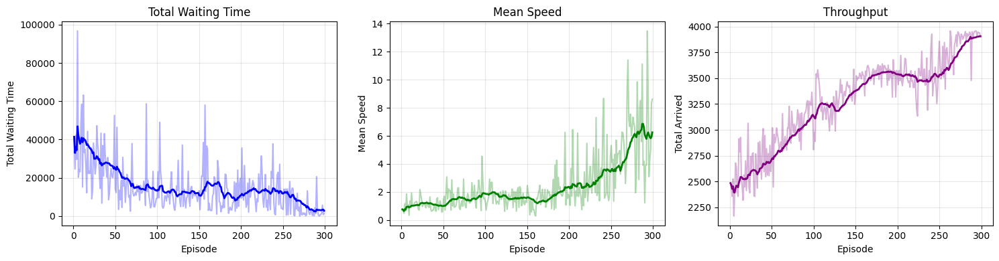

# RL Homework 1: Q-learning и DQN в SUMO-RL

## Описание

Реализация алгоритмов Q-learning и DQN для управления светофорами в симуляторе SUMO.

## Структура проекта

```
├── experiments/
│   ├── ql_4x4grid.py          # Q-learning для сетки 4x4
│   └── dqn_big-intersection.py # DQN для большого перекрёстка
├── outputs/
│   ├── 4x4grid_ql.zip         # CSV результаты Q-learning
│   └── big_intersection_ep.zip # CSV результаты DQN
├── images/
│   ├── task1.png              # График Q-learning
│   └── task2.png              # График DQN
```

### Q-learning (Task 1)
- Табличный Q-learning с ε-greedy
- Дискретизация наблюдений
- Decay epsilon

### DQN (Task 2)
- Dueling DQN архитектура
- Double DQN
- Prioritized Experience Replay
- Soft target update
- Нормализация состояний

## Результаты

### Q-learning (4x4 Grid)


### DQN (Big Intersection)
